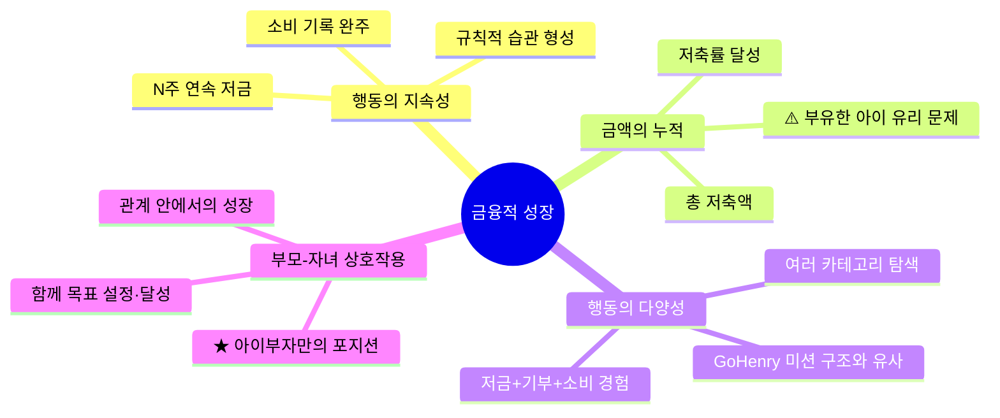

## 정의
청소년의 금융적 성장을 어떻게 측정·정의할 것인가에 대한 전략적 개념. 업계는 "연령=성장"을 암묵적 전제로 삼고 있지만, 연구 데이터는 이를 반박한다. 아이부자는 대안적 성장 기준을 설계에 반영함으로써 차별화할 수 있다.

## 핵심 내용

### 업계의 현재 전제: 연령 = 성장
- 토스유스·카카오뱅크 미니는 연령별 별도 UI 없이 규제 기준(만 14·19세)에 따라 기능 허용 범위만 조정
- 이는 금융 규제가 연령을 기준으로 설계되어 있기 때문 — 업계가 규제 구조를 그대로 UX에 투영한 결과

### 왜 연령만으로는 부족한가
- PISA 2022: 금융이해력은 연령보다 **사회경제적 배경(부모 학력)**의 영향이 더 강함
- 학년이 올라갈수록 금융 **태도**는 오히려 낮아지는 경향
- 즉, 나이가 들면 지식은 늘지만 금융에 대한 긍정적 태도·습관은 자동으로 형성되지 않음

### 대안적 성장 기준 4가지

## 전략적 함의

> **"연령=성장"이라는 업계 공통 전제를 깨는 것이 아이부자의 차별화 기회**

- 경쟁사(토스·카카오)는 개인 중심 금융 경험에 집중 → **부모-자녀 관계**는 구조적으로 제공하기 어려움
- 아이부자는 **Giver-Taker 구조**를 이미 보유 → "부모와 함께 성장"이라는 기준을 UX에 녹일 수 있는 유일한 플레이어
- 행동의 지속성·다양성 기준은 **게임화(미션·뱃지·레벨업)**로 구현 가능

## 설계 방향 제안
- 저축액 대신 **"N주 연속 저금 달성"** 뱃지 시스템
- 소비 카테고리 다양화를 **퀘스트**로 설계 (GoHenry 미션 구조 참고)
- 부모-자녀 공동 목표 기능 강화 → 단순 모니터링이 아닌 **협력 구조**로

## 연관 개념
- [[concepts/연령별-UX-전략]]
- [[concepts/아이부자-성장전략-개념도]]
- [[concepts/청소년-금융앱-경쟁구도]]
- [[concepts/해외-청소년금융앱-벤치마킹]]

## 출처
- [[sources/리서치-사고흐름-금융적성장기준]]
- [[sources/금융사회화이론-발달단계별청소년금융특성]]
- [[sources/청소년금융사회화-재무관리행동-매개효과]]
