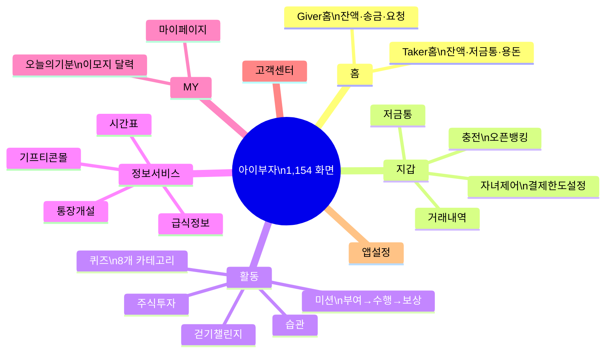

## 정의
1,154개 화면 분석을 통해 파악한 현재(AS-IS) 아이부자 앱의 UX/UI 구조와 패턴. To-Be 설계 시 기준점이 되는 현황 문서.

---

## 앱 구조 핵심 사실

- **화면 수:** 1,154개 (2024년 6월 기준 화면명세서 기준)
- **사용자 역할:** Giver(부모) / Taker(자녀) — 동일 앱에서 역할별 완전 분기
- **8개 주요 섹션:** 홈 / 지갑 / 활동 / 정보서비스 / MY / 고객센터 / 앱설정 / 기타

---

## Giver vs Taker — 역할별 경험 차이

| 구분 | Giver (부모) | Taker (자녀) |
|------|-------------|-------------|
| 홈 | 잔액, 송금, 정기지급, 받은 요청 | 잔액, 저금통 목표, 용돈 상태 |
| 미션 | 미션 부여, 보상 승인/거절 | 미션 수행, 인증샷 제출 |
| 자녀제어 | 결제한도 설정 | - |
| MY | 멤버관리, 충전계좌 | 금급찾기 비밀번호 추가 |

**평가:** Giver/Taker 이중 구조는 경쟁사에 없는 차별점이나, 역할 간 전환과 시각적 구분이 아직 명확하지 않음.

---

## 현재 강점 (유지해야 할 것)

1. **Giver-Taker 연결 경험** — 미션, 요청, 승인 플로우가 부모-자녀 소통의 핵심
2. **3D 일러스트 + 이모지** — 친근하고 감성적인 어린이 친화 비주얼
3. **오늘의 기분** — 이모지 감정 달력, 경쟁사에 없는 Well-being 차별점
4. **금융교육 콘텐츠 통합** — 미션·퀴즈·걷기챌린지·습관·주식투자 한 앱에
5. **생활정보 통합** — 시간표·급식으로 어린이 일상 진입점 확보

---

## 현재 약점 (개선해야 할 것)

### 구조적 문제
- **메뉴 과밀:** 드로어 메뉴에 기능이 너무 많음 → 신규 사용자 진입장벽
- **IA 미흡:** 기능 확장 속도 대비 정보 구조 정리 부족

### 비주얼 문제
- **아이콘 혼용:** 컬러 3D 아이콘 + 모노크롬 플랫 아이콘이 섞여 시각적 일관성 저해
- **디자인 시스템 미통일**

### 기능적 문제
- **저금통 진행률 바 너무 작음** → 달성감 전달 약함
- **기프티콘몰 별도 회원가입** — 마찰 발생
- **연령별 UI 미분화** — 초등생/중학생 같은 화면

---

## To-Be 개선 방향 (AS-IS 분석 기반)

| 우선순위  | 과제         | 근거            |     |
| ----- | ---------- | ------------- | --- |
| 🔴 즉시 | 메뉴 구조 재설계  | 드로어 기능 과밀     |     |
| 🔴 즉시 | 디자인 시스템 통일 | 아이콘 혼용        |     |
| 🟡 중기 | 연령별 UI 분화  | 초등/중학생 니즈 다름  |     |
| 🟡 중기 | 게임화 강화     | 경험치·레벨·뱃지 시스템 |     |
| 🟢 장기 | 가족 소통 허브화  | 응원·리액션 기능     |     |
| 🟢 장기 | 다크모드·접근성   | 현재 미지원        |     |

---

## 연결 지점 (다른 자료와의 관계)
- NPS 약점 1위인 "안정성(카드오류·앱속도)"은 이 보고서의 시스템 이슈와 연결 → [[concepts/아이부자-NPS-데이터]]
- 히든피겨스 3.0 컨셉(Build 02 자녀 자율관리)이 아직 충분히 구현되지 않음 확인 → [[sources/히든피겨스_아이부자3.0_UX컨설팅_2023]]
- 연령별 UI 미분화 = 이탈 원인과 직결 → [[concepts/연령별-UX-전략]]

---

## 관련 소스
- [[sources/아이부자_ASIS_UXUI분석보고서_2026]]
- [[sources/아이부자3.0_화면명세서_202406]]

## 관련 개념
- [[concepts/연령별-UX-전략]]
- [[concepts/아이부자-NPS-데이터]]
- [[concepts/청소년-금융앱-경쟁구도]]
