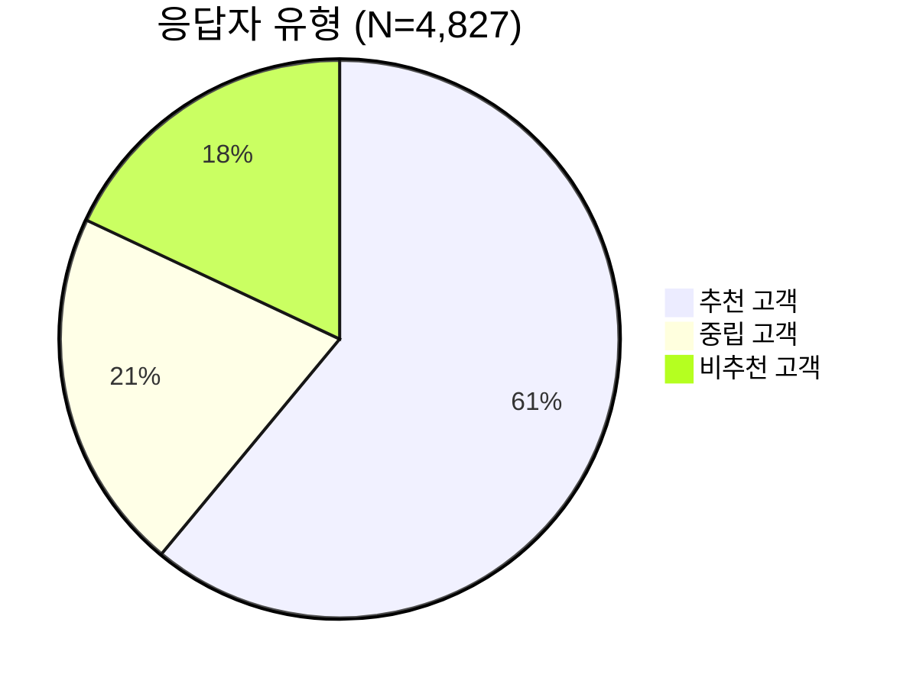
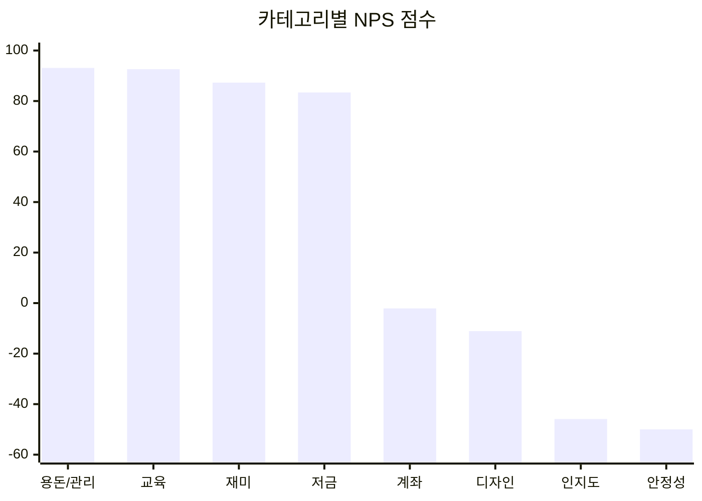

## 정의
아이부자 앱에 대한 사용자 순추천고객지수(Net Promoter Score) 조사 결과. 2025년 12월 기준 최신 정량 데이터.

## 핵심 수치
- **NPS 점수:** 42.6점
- **응답 수:** 4,827건
- **응답자 구성:** 부모 13%, 자녀 87%
- **추천/중립/비추천:** 61% / 21% / 18%

## 강점 카테고리 (높은 NPS × 높은 중요도)

| 카테고리 | NPS | 중요도 | 의미 |
|----------|-----|--------|------|
| 용돈/관리 | +93.1 | 17% | 핵심 사용 목적, 만족도 매우 높음 |
| 재미 | +87.3 | 11% | 재미 있지만 "더 재미있으면 좋겠다" 피드백 다수 |
| 저금/모으기 | +83.4 | 5% | 모으는 습관 형성 긍정 평가 |

## 약점 카테고리 (낮은 NPS × 높은 중요도)

| 카테고리 | NPS | 중요도 | 의미 |
|----------|-----|--------|------|
| **안정성** | **-50.0** | **24%** | **가장 중요한 약점 — 카드오류, 앱 속도** |
| 경쟁력/인지도 | -45.9 | 9% | "토스 쓰지 누가 아이부자씀?" |
| 계좌 | -2.1 | 4% | 가상계좌 없어 P2P 수취 불가 |

## 가장 시급한 개선 과제
1. **안정성 (중요도 24%)** — 티머니 카드 오류, 키오스크 결제 실패, 앱 로딩
2. **경쟁력/인지도** — 토스 대비 인지도 격차, 리워드 규모 차이
3. **계좌번호/가상계좌** — 친구에게 돈 받기 불가 = 소셜 기능 핵심 장벽

## 부모-자녀 니즈 충돌
- 부모: 자녀 소비 모니터링 원함 → 아이부자 유지 동기
- 자녀: 프라이버시 원함, 친구와 함께 쓰고 싶음 → 이탈 동기
- 이 긴장을 해소하는 UX가 핵심

## 관련 소스
- [[sources/아이부자팀_인앱NPS조사_2025]]
- [[sources/아이부자팀_리뉴얼사전자료_2026]]

## 관련 개념
- [[concepts/청소년-금융앱-경쟁구도]]
- [[concepts/연령별-UX-전략]]
