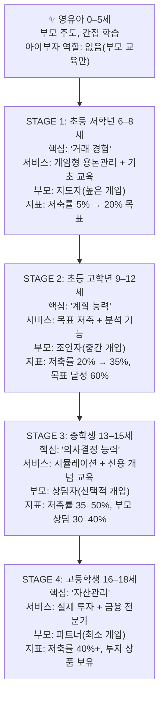

## 정의
아이부자를 "성장하는 금융 서비스 플랫폼"으로 포지셔닝하고, 사용자의 연령 성장에 따라 서비스가 함께 진화하는 4단계 전략 개념도.

## 핵심 구조

## 단계별 상세

| STAGE | 연령 | 핵심 역량 | 핵심 서비스 | 부모 역할 |
|-------|------|-----------|-------------|-----------|
| 1 | 초등 저학년 6–8세 | 거래 경험 | 게임형 용돈관리 + 기초 교육 | 지도자 (높은 개입) |
| 2 | 초등 고학년 9–12세 | 계획 능력 | 목표 저축 + 분석 기능 | 조언자 (중간 개입) |
| 3 | 중학생 13–15세 | 의사결정 능력 | 시뮬레이션 + 신용 개념 교육 | 상담자 (선택적 개입) |
| 4 | 고등학생 16–18세 | 자산관리 | 실제 투자 + 금융 전문가 | 파트너 (최소 개입) |

## 핵심 구조 특징
1. **연속성**: 각 단계가 이전 단계를 기반으로 자연스럽게 진화
2. **확장성**: 서비스가 계속 확대되고, 기존 기능은 유지
3. **개인화**: 각 단계에서 "그 나이에 필요한 것"만 제공
4. **유연성**: 아이의 속도에 맞춰 다음 단계로 전환

## 전략적 함의
- 중학교 진입(STAGE 3) 시점이 현재 가장 큰 이탈 구간 → 이 전환을 자연스럽게 만드는 것이 핵심 과제
- 부모 역할의 단계적 축소는 의도적으로 설계되어야 함 (갑작스러운 전환 X)
- STAGE 4의 "실제 투자" 기능은 하나원큐 전환의 자연스러운 브리지

## 연관 개념
- [[concepts/연령별-UX-전략]]
- [[concepts/고객-생애주기-전략]]
- [[concepts/청소년-금융앱-경쟁구도]]

## 출처
- [[sources/금융사회화이론-발달단계별청소년금융특성]]
- [[sources/금융감독원-금융교육표준-2023]]
- [[sources/히든피겨스_아이부자3.0_UX컨설팅_2023]]
- [[sources/청소년금융사회화-재무관리행동-매개효과]]
