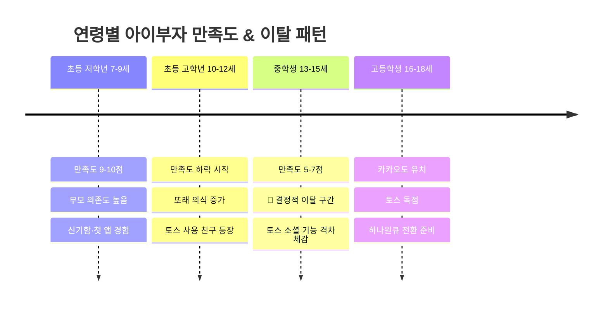

## 정의
아이부자가 초등·중학·고등학교 각 연령대에 맞는 UI/UX를 제공해야 한다는 전략적 방향. 의사결정권자가 핵심 요구사항으로 제시.

## 연령별 니즈 분석

### 초등 저학년 (7~9세)
- 첫 핸드폰, 첫 앱 경험 → 신기함 자체가 강한 동기
- 부모 의존도 높음 — 부모가 설정해주는 구조 수용
- 캐릭터·시각적 요소에 친화적
- 현재 아이부자 점수: 9~10점 (초기)

### 초등 고학년 (10~12세)
- 또래 의식 시작 → "친구들이 쓰는 것"이 중요
- "아이부자" 브랜딩·캐릭터가 유치하게 느껴지기 시작
- 소액 용돈 관리, 교통카드 등 실용적 기능 필요
- **이탈 위험 시작 구간**

### 중학생 (13~15세)
- 또래 문화 중심 — 토스 쿠폰/송금 공유 등 소셜 기능이 결정적
- 독립성 욕구 증가 — 부모 동의 없이 쓸 수 있는 기능 원함
- 브랜드 정체성 재설정 필요 (아이부자 → 틴즈 브랜드?)
- **결정적 이탈 구간**

### 고등학생 (16~18세)
- 카카오뱅크도 유치하게 느낌, 토스 독점
- 주식·외환 등 실질 투자 관심 증가
- 성인 앱으로 넘어가기 직전 — 하나원큐 전환 설계 필요

## 설계 원칙 (인터뷰 도출)

1. **같은 앱, 다른 화면** — 연령 설정에 따라 UI가 자동으로 달라져야
2. **아이 주도 경험** — 부모 중심 구조에서 탈피, 아이가 자율적으로 쓸 수 있는 기능
3. **금융 호기심 자극** — 교육 프레임 금지. "내 돈이 어떻게 변하는지" 시각화
4. **또래와 함께 쓸 수 있는 구조** — 소셜 기능, 친구 연결
5. **충격 요소** — "하나은행이 이런 것도 만들었어?" 반응

## 미해결 과제
- 초등 전체를 만족시키는 UI도 없음 — 개인화/커스터마이징 필요
- 브랜드명 변경 시점과 방법 (아이부자 → ?)
- 부모 동의 필요 기능 vs 아이 자율 기능 경계 설정

## 관련 산출물

- [서비스 청사진 — 부모 안내 시점별](../../../../아이부자 컨설팅/서비스청사진_부모관점.html) — Stage 1~4 각 연령대에서 시스템이 부모에게 무엇을 제공하고, 부모가 어떤 순서로 행동하는지 플로우로 시각화. 터치포인트(하나원큐/아이부자/메시지), 부자 습관 교육 근거, 데이터 레이어 포함.

## 관련 소스
- [[sources/F0401-의사결정권자-인터뷰]]
- [[sources/F0401-직접이해관계자-인터뷰]]

## 관련 개념
- [[concepts/청소년-금융앱-경쟁구도]]
- [[concepts/고객-생애주기-전략]]
