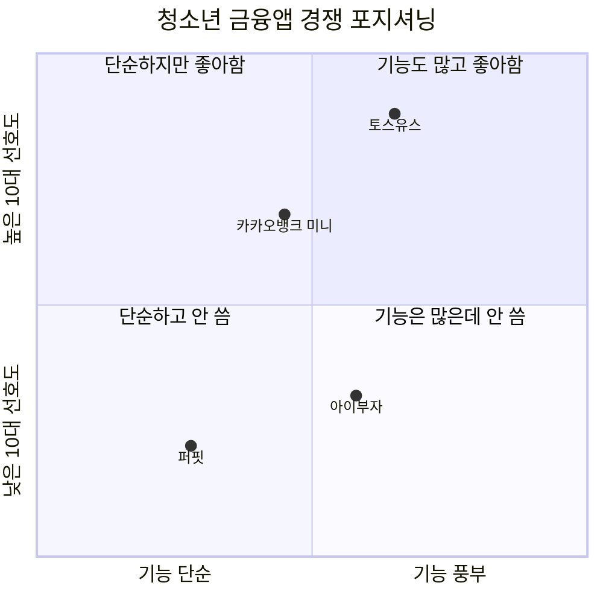

## 정의
국내 미성년자/청소년 대상 금융 앱 시장에서 주요 플레이어들의 포지셔닝과 경쟁 관계.

## 주요 플레이어

| 서비스 | 운영사 | 특징 |
|--------|--------|------|
| 아이부자 | 하나은행 | 선불+계좌 병행, 부모-자녀 연결, 금융교육 |
| 토스유스 | 토스뱅크 | 성인 토스 앱 내 연계, 또래 소셜 기능 강점 |
| 카카오뱅크 미니 | 카카오뱅크 | 카카오 생태계 연결, 친숙한 UI |
| 퍼핏 | 퍼핏 | 미성년 특화, 용돈 관리 중심 |

## 경쟁 우위 분석

**토스의 강점 (아이부자 관점의 위협)**
- 또래 문화 연결: 친구 간 쿠폰 공유, 송금이 자연스러운 일상
- "아이가 어른처럼 쓰는 느낌" — 성인 앱과 동일 플랫폼 경험
- 브랜드 신뢰도: 고등학생은 카카오뱅크도 유치, "무조건 토스"
- 후킹 요소: 시장 심리 읽기에 탁월, UX보다 '이유'를 만드는 능력

**아이부자의 잠재 강점 (아직 미활성화)**
- 마이데이터 연동 가능 (은행 면허 보유)
- 외환 정보·주식 연계 (은행 인프라 활용)
- 부모-자녀 소통 기능 (경쟁사에 없는 차별점)
- 수신 상품 연계 (우대금리 등 진짜 금융 혜택)

**구조적 불리함**
- 규제 비대칭: 토스뱅크보다 시중은행 규제가 훨씬 강함
- 별도 앱 구조: 하나원큐와 분리 → 두 번 설치 필요
- 기능 추가 속도: 상품 출시 프로세스가 핀테크보다 느림

## 이탈 패턴
- **초등 저학년:** 신기함·만족도 높음 (9~10점)
- **초등 고학년 (5~6학년):** 또래 토스 사용 시작 → 소셜 기능 격차 체감
- **중학교 진입:** 결정적 이탈 시점 — 아이부자 유치, 토스로 전환
- **고등학교:** 카카오뱅크도 유치, 토스 독점

## 정량 데이터 (2025.12 NPS 기준)
- 아이부자 NPS 42.6점 / 자녀의 직접 반응: "토스 쓰지 누가 아이부자씀?"
- 첫 금융사 선택 (오픈서베이 2025): 10대는 토스뱅크/카카오뱅크 압도적 선호
- 토스 강점: 사용성 + 설명 이해도 1위 → 금융 초보인 10~20대 초반에 특히 강점

## 핵심 시사점
> 아이부자는 UX 완성도보다 **'이 앱을 쓸 이유'(후킹 포인트)**와 **또래와 함께 쓸 수 있는 소셜 구조**가 더 시급한 과제.
> 해외에서는 이미 Earn & Learn + P2P + 부모 안전장치 조합이 표준 → [[concepts/해외-청소년금융앱-벤치마킹]]

## 성인 전환 후 주거래 고착 데이터 (컨슈머인사이트 2023.11)
- 성인 주거래율: KB국민(16.3%) > 카카오뱅크(11.7%) > 농협(9.7%) > 신한·하나(각 4.9%)
- 정기/생활필수 앱 1위: 토스(48.8%) — 압도적 1위
- 10~20대 차상위에 토스뱅크 포진 → 청소년기 선점이 성인 주거래로 이어짐을 시사

## 관련 소스
- [[sources/F0401-의사결정권자-인터뷰]]
- [[sources/F0401-직접이해관계자-인터뷰]]
- [[sources/F0402-이해관계자-인터뷰]]
- [[sources/오픈서베이_첫금융트렌드리포트_2025]]
- [[sources/아이부자팀_인앱NPS조사_2025]]
- [[sources/히든피겨스_청소년인터뷰_rawdata_2023]]
- [[sources/컨슈머인사이트-주거래은행조사-2023년11월]]

## 관련 개념
- [[concepts/연령별-UX-전략]]
- [[concepts/고객-생애주기-전략]]
